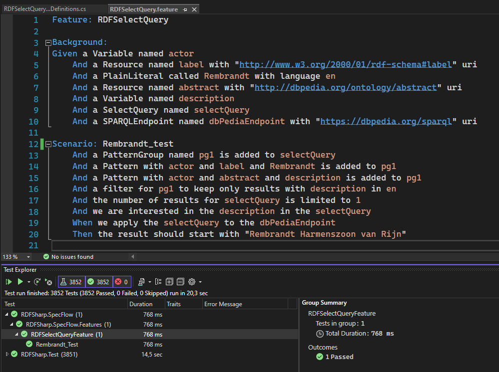

## issue: BDD #9

Létrehoztam az RDFSharp.SpecFlow projektet, hogy a SpecFlow-t, mint eszközt használva belenézzek a BDD elveibe, és módszertanába. 

Ez csak egy eszköz és nem képes a teljes BDD-t lefedni, csak az automatizálási lépéshez nagyon hasznos segítség. -> Létrehozhatunk vele végrehajtható "specifikációkat". Ez a projekten azt jelenti hogy természetes nyelvi szöveget használva tudunk teszteseteket leírni a Gherkin segítségével. 
A feladathoz Visual Studio-ra volt szükségem, szerencsére ez adott volt. Emellett a SpecFlow extension elengedhetetlen.

- Az RDFSelectQueryStepDefinition.cs fileban megírtam a kis lépéseket, és a hozzájuk tartozó reguláris kifejezéseket, hogy a természetes nyelven írt tesztek fordíthatóak legyenek kódra.
- Az RDFSelectQuery.feature fileban leírtam a tesztet. A background label alatt a tesztek előtti inicializáló kód található, a tesztet Scenario label jelzi.

Sikeresen lefutott.

